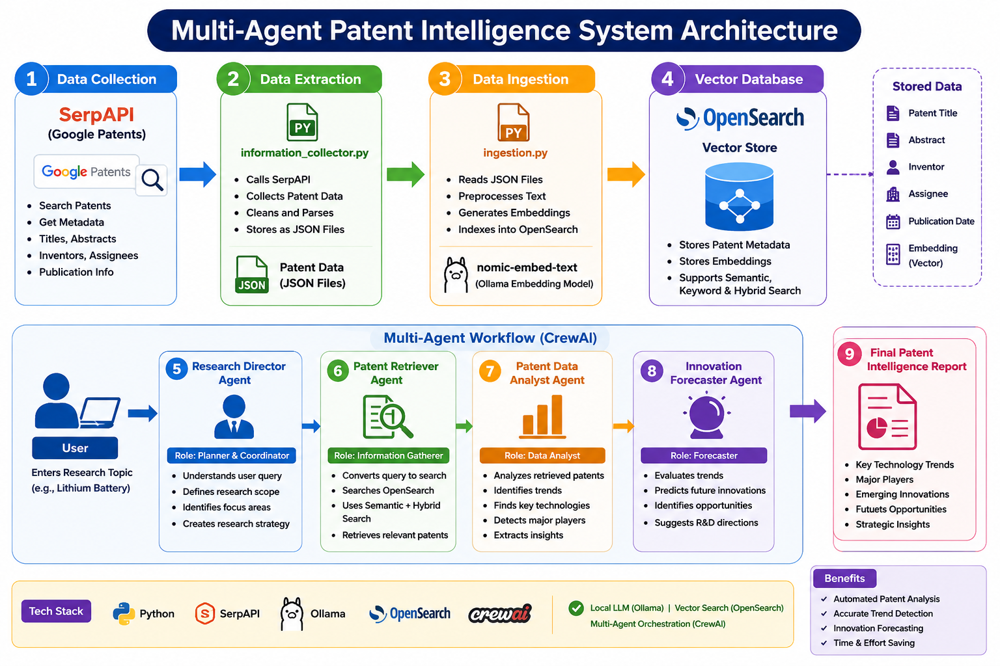

# Patent Innovation Predictor – Multi-Agent Patent Intelligence System


---

# Overview

Patent Innovation Predictor is an Agentic AI system that automates patent research, technology trend analysis, and innovation forecasting using a collaborative multi-agent architecture.

The platform combines SerpAPI, OpenSearch, CrewAI, Ollama, and semantic retrieval to analyze patent ecosystems and predict future technology directions.

Unlike traditional patent search systems, the platform performs end-to-end patent intelligence by coordinating specialized AI agents that retrieve patents, analyze technological patterns, identify innovation gaps, and generate future innovation forecasts.

---

# Project Screenshots

## Home Screen


The application provides multiple patent research workflows including trend analysis, patent search, iterative exploration, and system diagnostics.

---

## Research Director Agent


The Research Director defines the patent investigation strategy, identifies key technology domains, and creates the research roadmap.

---

## Patent Retriever Agent


The Patent Retriever gathers patent records using semantic retrieval and organizes them by technology categories and assignees.

---

## Patent Data Analyst Agent


The analyst identifies innovation trends, technology evolution, company focus areas, and emerging sub-technologies.

---

## Innovation Forecaster Agent


The forecaster predicts future technological breakthroughs and identifies disruptive innovations based on historical patent trends.

---

## Crew Execution Completion


CrewAI orchestrates all agents and manages task execution across the patent intelligence workflow.

---

## Final Patent Intelligence Report


The final report summarizes technology trends, patent activity, and future innovation forecasts.

---

# Business Problem

Patent analysts, R&D teams, and innovation managers spend significant time reviewing large volumes of patent documents to:

* Identify emerging technologies
* Track competitor innovation activity
* Analyze patent trends
* Discover white-space opportunities
* Forecast future technological developments

Manual analysis is expensive, time-consuming, and difficult to scale.

This project automates the complete patent intelligence workflow using Agentic AI.

---

# System Architecture Diagram



The Patent Innovation Predictor follows an Agentic AI architecture that combines patent retrieval, vector search, multi-agent orchestration, and local LLM inference to automate patent intelligence and innovation forecasting.

---

# System Architecture Flow

```text
User Research Topic
        |
        v
SerpAPI (Google Patents)
        |
        v
information_collector.py
        |
        v
Patent JSON Files
        |
        v
ingestion.py
        |
        v
nomic-embed-text (Ollama Embeddings)
        |
        v
OpenSearch Vector Database
        |
        v
CrewAI Orchestrator
        |
        +-----------------------------+
        |                             |
        v                             v
Research Director Agent      Patent Retriever Agent
                                      |
                                      v
                             Semantic / Hybrid Search
                                      |
                                      v
                           Patent Knowledge Base
                                      |
                                      v
                           Patent Data Analyst Agent
                                      |
                                      v
                           Innovation Forecaster Agent
                                      |
                                      v
                      Final Patent Intelligence Report
```

---

# Workflow Explanation

1. SerpAPI collects patent information from Google Patents.
2. information_collector.py stores patent metadata as JSON files.
3. ingestion.py processes patent data and generates embeddings.
4. nomic-embed-text converts patent abstracts into vector embeddings.
5. OpenSearch stores patent metadata and vector embeddings.
6. CrewAI orchestrates the multi-agent workflow.
7. Research Director defines the research strategy.
8. Patent Retriever performs semantic and hybrid retrieval.
9. Patent Data Analyst identifies trends and innovation patterns.
10. Innovation Forecaster predicts future technology opportunities.
11. The system generates a Patent Intelligence Report containing trends, forecasts, and strategic insights.

---

# Key Features

## Multi-Agent Patent Research

Four specialized AI agents collaborate to perform patent intelligence tasks:

* Research Director Agent
* Patent Retriever Agent
* Patent Data Analyst Agent
* Innovation Forecaster Agent

## Patent Retrieval

* Semantic patent search
* Hybrid retrieval
* Technology-specific patent discovery
* Similar patent exploration

## Patent Trend Analysis

* Technology evolution tracking
* Innovation growth analysis
* Company focus analysis
* Emerging technology identification

## Innovation Forecasting

* Future technology prediction
* Breakthrough opportunity detection
* R&D investment recommendations
* Disruptive technology identification

## Local LLM Inference

* Runs entirely on Ollama
* Supports DeepSeek-R1, Llama, and Mistral
* No dependency on external LLM APIs

## Automated Report Generation

Generates structured reports containing:

* Patent summaries
* Technology trends
* Innovation forecasts
* Strategic recommendations

---

# Agent Responsibilities

## Research Director

Creates the research strategy by:

* Defining technology focus areas
* Selecting analysis scope
* Identifying key innovation categories

## Patent Retriever

Retrieves relevant patents using:

* Semantic Search
* Hybrid Search
* OpenSearch Retrieval

Outputs:

* Patent datasets
* Assignee information
* Technology categories

## Patent Data Analyst

Analyzes patent collections to identify:

* Innovation trends
* Technology evolution
* Emerging sub-technologies
* Company innovation focus

## Innovation Forecaster

Predicts future developments by:

* Forecasting innovation directions
* Identifying disruptive technologies
* Recommending R&D opportunities
* Generating strategic insights

---

# Technology Stack

## Backend

* Python

## Data Collection

* SerpAPI
* Google Patents

## Agent Framework

* CrewAI

## Embedding Layer

* Ollama
* nomic-embed-text

## LLM Layer

* DeepSeek-R1
* Llama
* Mistral

## Retrieval Layer

* OpenSearch
* Vector Search
* Semantic Search
* Hybrid Search

## Deployment

* Docker

---

# Project Metrics

* Patent Collection Source: SerpAPI
* Embedding Model: nomic-embed-text
* Embedding Dimension: 768
* Vector Database: OpenSearch 2.11
* Retrieval Method: Semantic Search + Hybrid Search
* Agent Framework: CrewAI
* Local LLM: Ollama
* Deployment Environment: Docker

---

# Challenges Faced

## Docker & OpenSearch Setup

* Docker engine connection issues prevented OpenSearch startup.
* Resolved container networking and environment configuration.

## Ollama Configuration

* Installed and configured Ollama for local model inference.
* Integrated embedding and LLM models successfully.

## Embedding Indexing Error

* OpenSearch rejected documents due to null embeddings.
* Added validation before indexing patent records.

## CrewAI Compatibility Issues

* Resolved version compatibility issues between CrewAI and LLM integrations.

## Dependency Management

Resolved installation issues related to:

* tiktoken
* crewai
* langchain-ollama
* opensearch-py

---

# Example Workflow

1. User selects a technology domain (Lithium Battery).
2. Research Director creates a research strategy.
3. Patent Retriever gathers relevant patents.
4. Patent Data Analyst identifies trends and innovation patterns.
5. Innovation Forecaster predicts future breakthroughs.
6. Final intelligence report is generated automatically.

---

# Future Enhancements

* Real-time patent ingestion
* Patent visualization dashboards
* LangGraph-based agent orchestration
* Multi-modal patent analysis
* Citation network analysis
* Competitive intelligence dashboards
* Patent clustering and categorization
* Trend forecasting visualizations

---

# Skills Demonstrated

* Agentic AI
* CrewAI
* Multi-Agent Systems
* RAG
* OpenSearch
* Ollama
* LLM Integration
* Semantic Search
* Hybrid Search
* Patent Analytics
* Innovation Forecasting
* Vector Databases
* AI System Design
* Python Development
* Docker
* Research Automation

---

# Author

**Pranali Dayanand Misal**

AI Engineer | Generative AI | Agentic AI | RAG Systems | LLM Applications

Focused on building AI-powered research, compliance, and intelligent automation systems using modern GenAI frameworks.
