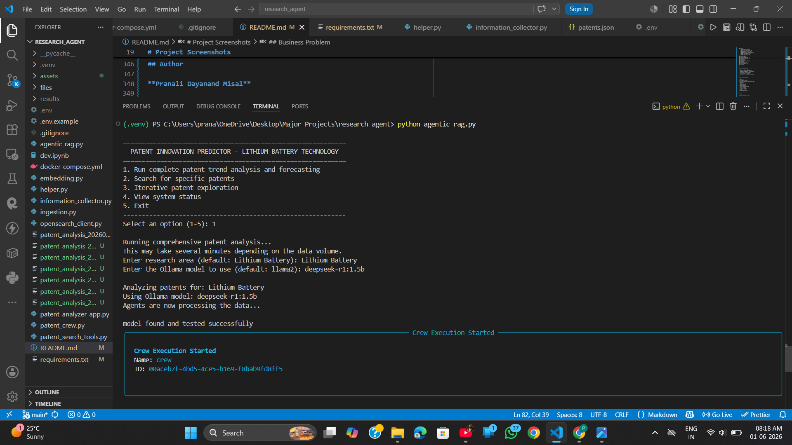
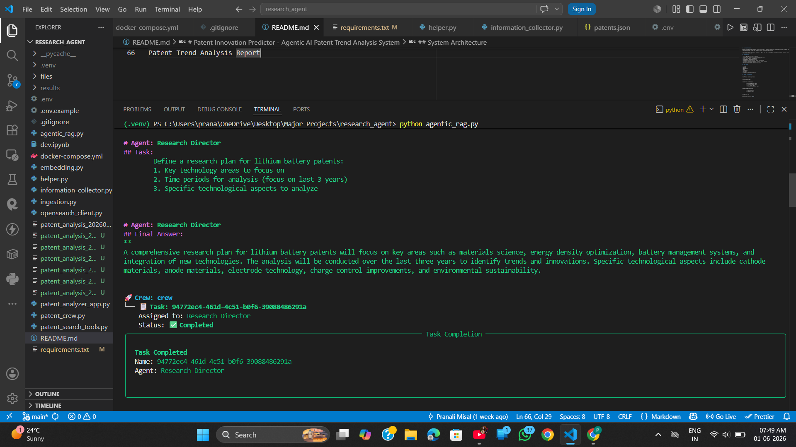
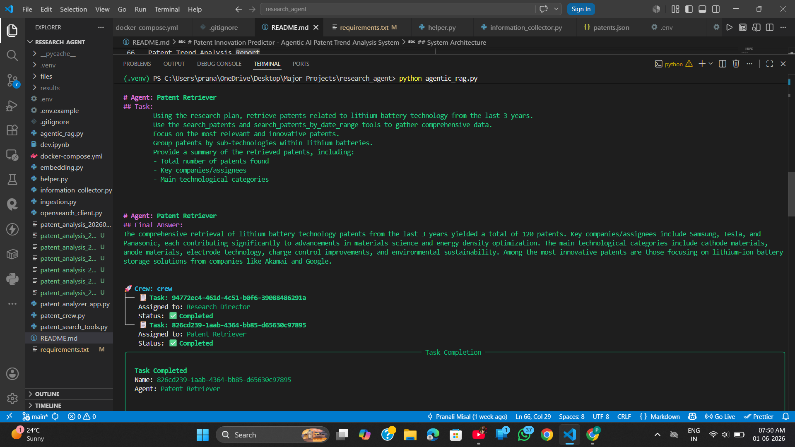
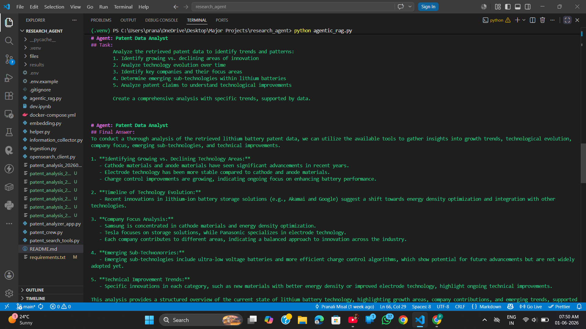
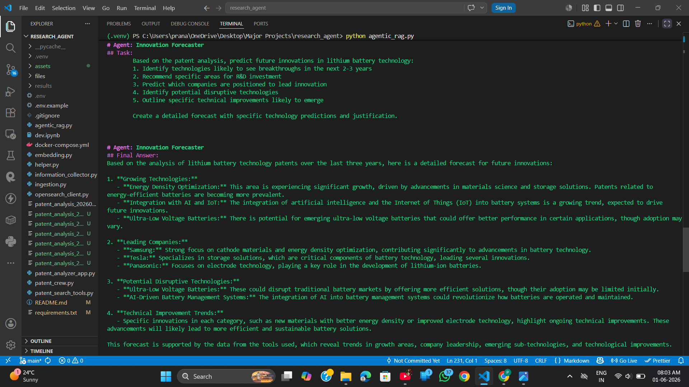
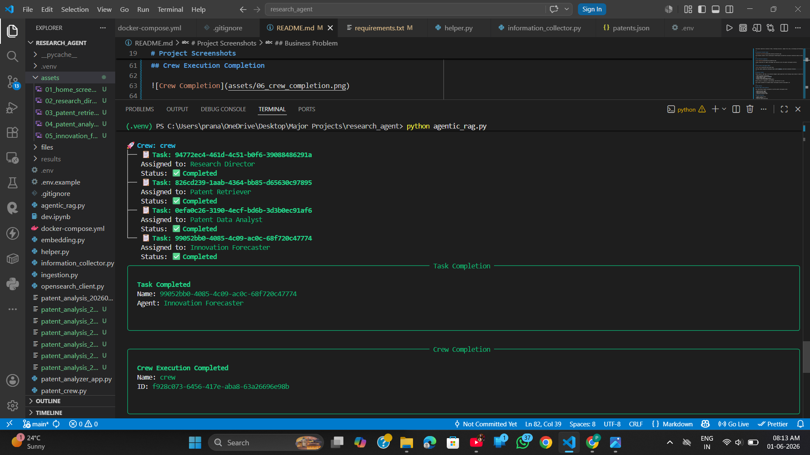
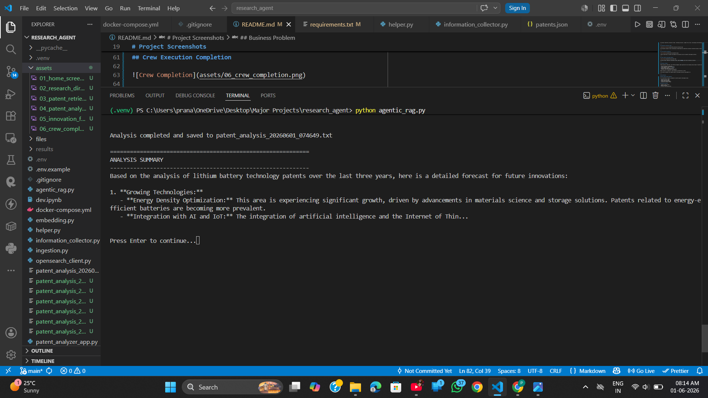

# Patent Innovation Predictor – Multi-Agent Patent Intelligence System


## Overview

Patent Innovation Predictor is an Agentic AI system that automates patent research, technology trend analysis, and innovation forecasting using a collaborative multi-agent architecture.

The platform leverages CrewAI agents, Retrieval-Augmented Generation (RAG), OpenSearch retrieval, and locally hosted Large Language Models through Ollama to analyze patent ecosystems and predict future technology directions.

Unlike traditional patent search systems, the platform performs end-to-end patent intelligence by coordinating specialized AI agents that retrieve patents, analyze technological patterns, identify innovation gaps, and generate future innovation forecasts.

---

# Project Screenshots

## Home Screen



The application provides multiple patent research workflows including trend analysis, patent search, iterative exploration, and system diagnostics.

---

## Research Director Agent



The Research Director defines the patent investigation strategy, identifies key technology domains, and creates the research roadmap.

---

## Patent Retriever Agent



The Patent Retriever gathers patent records using semantic retrieval and organizes them by technology categories and assignees.

---

## Patent Data Analyst Agent



The analyst identifies innovation trends, technology evolution, company focus areas, and emerging sub-technologies.

---

## Innovation Forecaster Agent



The forecaster predicts future technological breakthroughs and identifies disruptive innovations based on historical patent trends.

---

## Crew Execution Completion



CrewAI orchestrates all agents and manages task execution across the patent intelligence workflow.

---

## Final Patent Intelligence Report



The final report summarizes technology trends, patent activity, and future innovation forecasts.

---

## Business Problem

Patent analysts, R&D teams, and innovation managers spend significant time reviewing large volumes of patent documents to:

* Identify emerging technologies
* Track competitor innovation activity
* Analyze patent trends
* Discover white-space opportunities
* Forecast future technological developments

Manual analysis is expensive, time-consuming, and difficult to scale.

This project automates the complete patent intelligence workflow using Agentic AI.

---

## Key Features

### Multi-Agent Patent Research

Four specialized AI agents collaborate to perform patent intelligence tasks:

* Research Director Agent
* Patent Retriever Agent
* Patent Data Analyst Agent
* Innovation Forecaster Agent

### Patent Retrieval

* Semantic patent search
* Hybrid retrieval
* Prior-art style exploration
* Technology-specific patent discovery

### Patent Trend Analysis

* Technology evolution tracking
* Innovation growth analysis
* Company focus analysis
* Emerging technology identification

### Innovation Forecasting

* Future technology prediction
* Breakthrough opportunity detection
* R&D investment recommendations
* Disruptive technology identification

### Local LLM Inference

* Runs entirely on Ollama
* Supports DeepSeek-R1, Llama, Mistral and other local models
* No dependency on external LLM APIs

### Automated Report Generation

Generates structured reports containing:

* Patent summaries
* Technology trends
* Innovation forecasts
* Strategic recommendations

---

## System Architecture

```text
User Research Query
        |
        v
CrewAI Orchestrator
        |
        +---------------------------+
        |                           |
        v                           v
Research Director Agent      Patent Retriever Agent
                                      |
                                      v
                             OpenSearch Retrieval
                                      |
                                      v
                             Patent Knowledge Base
                                      |
                                      v
                           Patent Data Analyst Agent
                                      |
                                      v
                           Innovation Forecaster Agent
                                      |
                                      v
                        Innovation Forecast Report
```

---

## Agent Responsibilities

### Research Director

Creates the research strategy by:

* Defining technology focus areas
* Selecting analysis scope
* Identifying key innovation categories

### Patent Retriever

Retrieves relevant patents using:

* Semantic Search
* Hybrid Search
* Iterative Retrieval

Outputs:

* Patent datasets
* Assignee information
* Technology categories

### Patent Data Analyst

Analyzes patent collections to identify:

* Innovation trends
* Technology evolution
* Emerging sub-technologies
* Company innovation focus

### Innovation Forecaster

Predicts future developments by:

* Forecasting innovation directions
* Identifying disruptive technologies
* Recommending R&D opportunities
* Generating strategic insights

---

## Technology Stack

### Backend

* Python

### Agent Framework

* CrewAI

### LLM Layer

* Ollama
* DeepSeek-R1
* Llama Models

### Retrieval Layer

* OpenSearch

### RAG Components

* Embeddings
* Vector Search
* Semantic Retrieval

### Application Layer

* Streamlit

### Deployment

* Docker

---

## Example Workflow

1. User selects a technology domain (Lithium Battery).
2. Research Director creates a research strategy.
3. Patent Retriever gathers relevant patents.
4. Patent Data Analyst identifies trends and innovation patterns.
5. Innovation Forecaster predicts future breakthroughs.
6. Final intelligence report is generated automatically.

---

## Sample Output

### Technology Domain

Lithium Battery

### Key Findings

* Growth in energy density optimization
* Increased patent activity in battery management systems
* Emerging innovations in advanced cathode materials
* Strong innovation contributions from Samsung, Tesla, and Panasonic

### Forecast

* AI-driven battery management systems
* Advanced energy storage architectures
* Next-generation battery materials
* Smart battery monitoring technologies

---

## Project Structure

```text
research_agent/
│
├── assets/
│   ├── 01_home_screen.png
│   ├── 02_research_director.png
│   ├── 03_patent_retriever.png
│   ├── 04_patent_analyst.png
│   ├── 05_innovation_forecaster.png
│   ├── 06_crew_completion.png
│   └── 07_final_report.png
│
├── agentic_rag.py
├── patent_crew.py
├── patent_search_tools.py
├── patent_analyzer_app.py
├── ingestion.py
├── embedding.py
├── information_collector.py
├── helper.py
├── requirements.txt
├── docker-compose.yml
└── README.md
```

---

## Future Enhancements

* Real-time patent ingestion
* Patent visualization dashboards
* LangGraph-based agent orchestration
* Multi-modal patent analysis
* Citation network analysis
* Competitive intelligence dashboards

---

## Skills Demonstrated

* Agentic AI
* CrewAI
* Multi-Agent Systems
* Retrieval-Augmented Generation (RAG)
* OpenSearch
* Ollama
* LLM Integration
* Semantic Search
* Patent Analytics
* Innovation Forecasting
* Vector Databases
* AI System Design
* Python Development
* Docker
* Research Automation

---

## Author

**Pranali Dayanand Misal**

AI Engineer | Generative AI | Agentic AI | RAG Systems | LLM Applications

Focused on building AI-powered research, compliance, and intelligent automation systems using modern GenAI frameworks.
